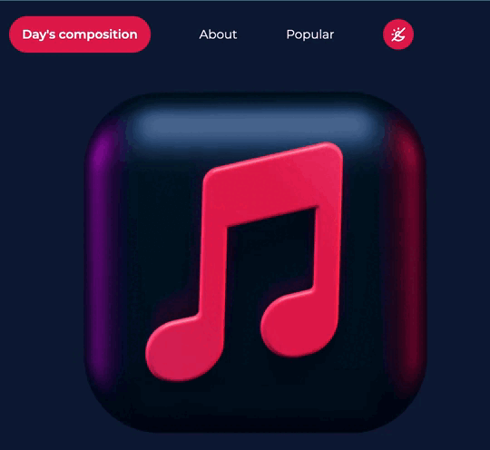

# MusicVibes

MusicVibes is an adaptive layout I created using the Tailwind CSS framework. You can see the full design by following this [link](https://luchiweb.github.io/MusicVibe/)

## The idea

The inspiration for this project came to me quite **spontaneously**. One day, for the hundredth or thousandth time listening to my playlist, I realized that while mixed listening to different songs, I often switch most of them just because I am not in the "right" mood for them. </br></br>
This is exactly what **MusicVibes** is for.

## Get start

If you want to copy the project and run it on your computer, follow these steps

```bash
git clone https://github.com/Luchiweb/MusicVibe.git
```

```bash
npm install --save-dev
```

## Additional libraries

To implement the slider, I used the library [Flowbite](https://flowbite.com/docs/getting-started/quickstart/). Now it is added through cdn, but if you want to implement the library locally, just do this action:

> Expand the `<script>` stop before the closing `</body>` tag

```html
<script src="./node_modules/flowbite/dist/flowbite.js"></script>
```

## Dark mode

The site is presented in two themes: **light** and **dark**


</br></br>

</br></br>

The simplicity of creating a dark theme for an app or website is one of the awesome advantages of using the tilewind framework. After in fact, all you need to do is write styles with the prefix `dark:` for the elements you want to change depending on the theme, and create a button functionality that will hang the `class="dark"` on the document

## Features

### Paralax



### Hover gradient


<br><br>


## Author:

## [Svitlana Moiseienko 🫶🏻](https://github.com/Luchiweb)

## License

## [MIT](https://choosealicense.com/licenses/mit/)
